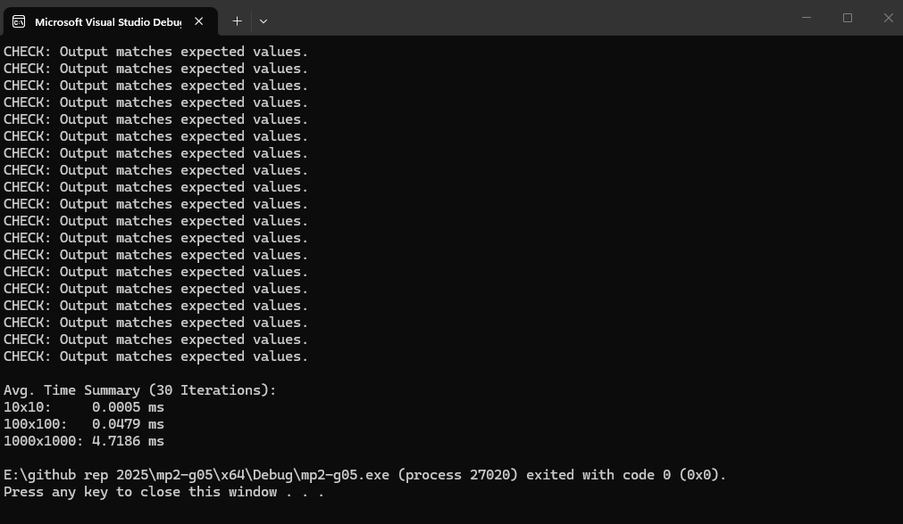

# LBYARCH S25H Machine Project 2:

## Grayscale Image Conversion (Unsigned 8-bit Integer to Double Precision)

**Group 09:**

- HO, Denise Liana P.
- PANGAN, Aaliyah Maxine Rochelle

**Video Demo:**
[ LBYARCH S25H GRP9 MP2 DEMO](https://drive.google.com/file/d/1Q6xun2aYbb8vReTx_Jl_n2Px4hyNGB3_/view?usp=sharing)

## Project Overview

This project implements grayscale image conversion from uint8 representation
to a double-precision floating-point representation. This involves obtaining the width and height
of the image, reading the pixel values (ranging 0 to 255), converting them to double-precision floats,
dividing each pixel value by 255, and finally outputting the image (in matrix form).

**Sample Input:**

```
Enter height and width: 3 4
Enter pixel 12 values:
64 89 114 84
140 166 191 84
216 242 38 84
```

**Sample Output:**

```
Output:
0.25 0.35 0.45 0.33
0.55 0.65 0.75 0.33
0.85 0.95 0.15 0.33
```

## Setup Instructions

### Requirements

- Windows 10/11
- Visual Studio
- NASM
- x64 build environment

### Steps

1. Navigate to the project directory and open `lbyarch-mp2-g09.slnx` to open the Visual Studio project.

2. Configure `asmfunc.asm` for the custom build tool:
   - Right-click `asmfunc.asm` > **Properties**
   - Go to **Configuration Properties > General**
   - Set **Excluded From Build**: `No`
   - Set **Item Type**: `Custom Build Tool`
   - Click **Apply**

3. Configure the Custom Build Tool:
   - Go **Custom Build Tool > General**
   - Set **Command Line** to path of NASM installation: `C:\[...]\nasm\nasm -f win64 asmfunc.asm`
   - Set **Outputs** to `asmfunc.obj`

4. Make sure the project is configured for **x64**:
   - Select **Build > Configuration Manager**
   - Set **Active solution platform** to `x64`

5. Configure linker to include `legacy_stdio_definitions.lib`:
   - Right-click the project > **Properties**
   - Go to **Configuration Properties > Linker > Input**
   - Under **Additional Dependencies**, select **Edit**
   - Add:`legacy_stdio_definitions.lib`

6. Press **Ctrl + F5** to build and run the program without debugging.

Note: To run the benchmarking suite, uncomment `benchmarkSuite(30)` in `main.c` and comment out the `convert()` function call.

### Accessing .exe Build
The compiled executable can be found in the `x64\Debug` folder of the project directory. The file is named `lbyarch-mp2-g09.exe`.


## Testing and Benchmarking Methodology

### Correctness Testing

Output correctness was verified using `checker()`, which computed the expected output values for a given
input. The computation, dividing each `uint8_t` value by 255.0, was done in C and compared to the output of
`imgCvtGrayIntToDouble()`, which performed the same computation in x86-64 Assembly.

The `checker()` function was also used to validate the outputs in the `benchmarkSuite()` function, where
all 30 iterations of the 3 test cases were run (10x10, 100x100, and 1000x1000). All 90 total outputs were verified to be correct, and
thus the program was deemed correct.

### Performance Testing

For performance testing, `benchmarkSuite(30)` is used to run 30 iterations of 3 test cases. The function itself consolidates the use of the `benchmark()` function, which
runs the conversion however many times are given by the dimensions of the pixel array and number of
iterations. The function uses `timeConversion()` internally, which runs one instance of the conversion
after generating a `w * h` pixel array with a random value and returns the time taken in milliseconds
for the conversion to complete.

The execution time for each iteration was recorded and averaged to determine the overall performance
of the program. The results showed that the program efficiently converted grayscale images of varying
sizes and pixel values, with consistent execution times across the different test cases.

## Execution and Performance Analysis

### Correctness Check

The screenshot below shows a sample run of the program with the `checker()` correctness validation enabled, confirming the assembly output `(imgCvtGrayIntToDouble)` matches the expected `pixel / 255.0` value for every pixel:



### Benchmark Results

`benchmarkSuite(30)` was used to measure the average execution time of `imgCvtGrayIntToDouble` over 30 iterations for each of the three required image sizes. Only the assembly function call itself was timed using `QueryPerformanceCounter`. Memory allocation, input generation, and correctness checking were performed outside the timed section.

| Image Size  | Total Pixels | Avg. Execution Time (ms) |
|-------------|--------------|--------------------------|
| 10 x 10     | 100          | 0.0005                   |
| 100 x 100   | 10,000       | 0.0479                   |
| 1000 x 1000 | 1,000,000    | 4.7186                   |

### Short Analysis
- **Correctness:** All 90 outputs (30 iterations × 3 test cases) were verified against the expected `pixel / 255.0` values using `checker()`. No mismatches greater than 1e-9 were found. This confirms that `imgCvtGrayIntToDouble` produces the same results as the equivalent C computation.
- **Scaling behavior:** The assembly function processes one pixel at a time using a simple loop. For each pixel, it performs one integer to double conversion `(cvtsi2sd)`, one floating point division `(divsd)`, and one store operation `(movsd)`. Since each pixel requires the same amount of work, the execution time increases approximately in proportion to the number of pixels processed. The measured execution times closely follow the increase in image size, confirming the expected O(n) time complexity (running time change as input size change)
- **Efficiency:** The implementation uses `SSE2` scalar floating point instructions with `XMM` registers instead of the legacy x87 floating point stack. This keeps the computation simple and efficient while performing a fixed number of operations for each pixel. As the image size increases, the assembly function must read, convert, divide, and store more pixels. Since these operations are repeated once for every pixel, they make up most of the execution time. This is why the execution time increases approximately in proportion to the number of pixels processed. 